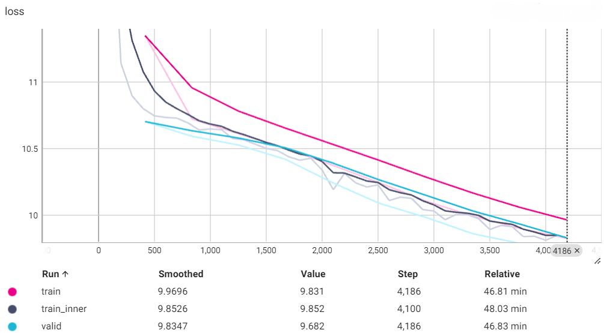
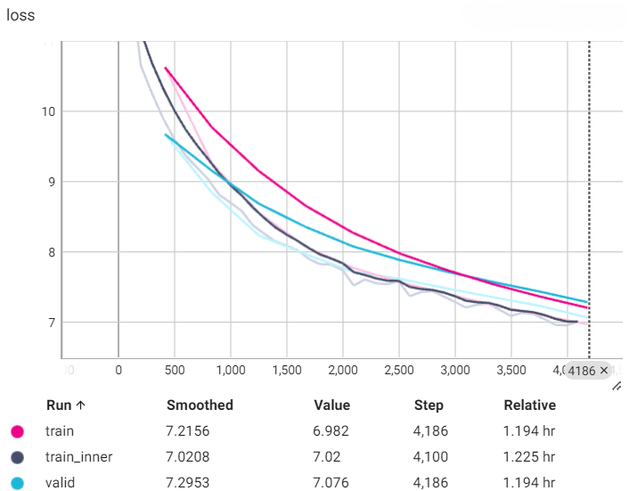
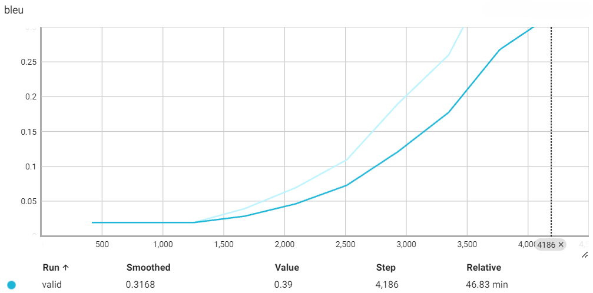
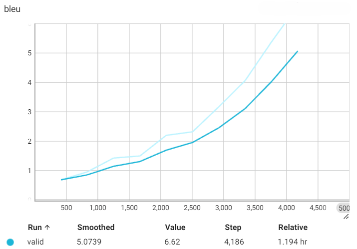

# Machine Translation Evaluation with LSTM and Transformer Models

This project evaluates machine translation models using LSTM and Transformer architectures. The models are trained and evaluated using BLEU and COMET metrics to compare their performance. We use the MIZAN dataset ([github](https://github.com/omidkashefi/Mizan), [paper](https://arxiv.org/abs/1801.02107)) to translation from English to Farsi.

## Table of Contents

- [Introduction](#introduction)
- [Setup](#setup)
- [Data Preparation](#data-preparation)
- [Training](#training)
- [Evaluation](#evaluation)
- [Results](#results)
- [Acknowledgements](#acknowledgements)

## Introduction

This project aims to compare the performance of LSTM and Transformer-based machine translation models. The evaluation is performed using two metrics:
- **BLEU (Bilingual Evaluation Understudy)**: A traditional n-gram overlap metric.
- **COMET (Crosslingual Optimized Metric for Evaluation of Translation)**: A more recent, machine learning-based metric that correlates better with human judgments.

## Setup

To get started, clone the repository and install the required packages.

```sh
git clone https://github.com/m-salmani78/lstm-vs-transformer-mt
```

## Data Preparation

### 1. Download and Prepare the Dataset

Ensure you have the dataset files `MIZAN.en-fa.en` for English sentences and `MIZAN.en-fa.fa` for Persian sentences.

### 2. Filter and Clean the Dataset

Filter out sentences with fewer than 10 tokens or more than 50 tokens:

```python
def filter_dataset(en_lines, fa_lines, min_tokens=10, max_tokens=50):
    filtered_en_lines = []
    filtered_fa_lines = []
    for en_line, fa_line in zip(en_lines, fa_lines):
        tokens = fa_line.strip().split()
        if min_tokens <= len(tokens) <= max_tokens:
            filtered_en_lines.append(en_line)
            filtered_fa_lines.append(fa_line)
    return filtered_en_lines, filtered_fa_lines

filtered_en_lines, filtered_fa_lines = filter_dataset(en_lines, fa_lines)
```

### 3. Split the Dataset

Shuffle the dataset and split it into training, validation, and test sets with numbers of 500000, 5000, and 10000.

### 4. Train SentencePiece Models

Train SentencePiece BPE tokenizers:

```python
def write_temp_file(lines, filename):
    with open(filename, 'w', encoding='utf-8') as file:
        file.write('\n'.join(lines))

def train_sentencepiece(input_file, model_prefix, vocab_size):
    spm.SentencePieceTrainer.train(input=f'{input_file}', model_prefix=model_prefix, vocab_size=vocab_size, model_type='bpe')

write_temp_file(train_en, f'{tokenizers_path}/train_en_temp.txt')
write_temp_file(train_fa, f'{tokenizers_path}/train_fa_temp.txt')

vocab_size = 10000

train_sentencepiece(f'{tokenizers_path}/train_en_temp.txt', 'spm_en', vocab_size=vocab_size)
train_sentencepiece(f'{tokenizers_path}/train_fa_temp.txt', 'spm_fa', vocab_size=vocab_size)
```

### 5. Preprocess the Data with Fairseq

Preprocess the data to create binarized data files:

```sh
fairseq-preprocess --source-lang en --target-lang fa \
  --trainpref ./raw_data/train \
  --validpref ./raw_data/valid \
  --testpref ./raw_data/test \
  --destdir ./data_bin/ \
  --srcdict spm_en.vocab \
  --tgtdict spm_fa.vocab \
  --nwordssrc 10000 \
  --nwordstgt 10000
```

These steps prepare the dataset for training the LSTM and Transformer models.

## Training

### LSTM Model

Train the LSTM model:

```sh
!fairseq-train \
    "./data_bin" \
    --arch lstm --encoder-layers 6 --decoder-layers 6 \
    --share-decoder-input-output-embed \
    --optimizer adam --adam-betas '(0.9, 0.98)' --clip-norm 0.0 \
    --lr 2e-3 --lr-scheduler inverse_sqrt --warmup-updates 4000 \
    --dropout 0.3 --weight-decay 0.0001 \
    --criterion label_smoothed_cross_entropy --label-smoothing 0.2 \
    --max-tokens 32768 \
    --eval-bleu \
    --eval-bleu-args '{"beam": 5, "max_len_a": 1.2, "max_len_b": 10}' \
    --eval-bleu-detok moses \
    --eval-bleu-print-samples \
    --best-checkpoint-metric bleu --maximize-best-checkpoint-metric \
    --fp16 --memory-efficient-fp16 \
    --max-epoch 10 \
    --save-dir ./data_bin/checkpoints_lstm/ \
    --tensorboard-logdir ./data_bin/logs_lstm \
    --source-lang en --target-lang fa
```

### Transformer Model

Train the Transformer model:

```sh
!fairseq-train \
    "./data_bin" \
    --arch transformer --encoder-layers 6 --decoder-layers 6 \
    --task translation \
    --share-decoder-input-output-embed \
    --optimizer adam --adam-betas '(0.9, 0.98)' --clip-norm 0.0 \
    --lr 8e-4 --lr-scheduler inverse_sqrt --warmup-updates 1000 \
    --dropout 0.1 --weight-decay 0.0001 \
    --criterion label_smoothed_cross_entropy --label-smoothing 0.2 \
    --max-tokens 32768 \
    --eval-bleu \
    --eval-bleu-args '{"beam": 5, "max_len_a": 1.2, "max_len_b": 10}' \
    --eval-bleu-detok moses \
    --eval-bleu-print-samples \
    --best-checkpoint-metric bleu --maximize-best-checkpoint-metric \
    --fp16 --memory-efficient-fp16 \
    --max-epoch 10 \
    --save-dir ./data_bin/checkpoints_transformer_2/ \
    --tensorboard-logdir ./data_bin/logs_transformer_2 \
    --source-lang en --target-lang fa
```

## Evaluation

Generate translations and evaluate using BLEU and COMET:

```sh
!fairseq-generate \
    "./data_bin" \
    --batch-size 256 \
    --path "./data_bin/checkpoints_lstm/checkpoint_best.pt" \
    --beam 5 > "./data_bin/new_eval_lstm.txt"

!fairseq-generate \
    "./data_bin" \
    --batch-size 256 \
    --path "./data_bin/checkpoints_transformer/checkpoint_best.pt" \
    --beam 5 > "./data_bin/new_eval_transformer.txt"
```

### Decode and Evaluate with COMET

```python
import sentencepiece as spm
from comet import download_model, load_from_checkpoint

# Load the BPE models
spm_en = spm.SentencePieceProcessor()
spm_en.load("spm_en.model")

spm_fa = spm.SentencePieceProcessor()
spm_fa.load("spm_fa.model")

# Function to decode sentences
def decode_sentences(tokenizer, sentences):
    return [tokenizer.decode(sentence.split()) for sentence in sentences]

# Decode hypotheses and references
def extract_hypothesis_and_references(file_path):
    with open(file_path, 'r', encoding='utf-8') as file:
        lines = file.readlines()
    
    src_sentences = []
    hypotheses = []
    references = []

    for line in lines:
        if line.startswith('S-'):
            src_sentences.append(line.split('\t')[1].strip())
        elif line.startswith('H-'):
            hypotheses.append(line.split('\t')[2].strip())
        elif line.startswith('T-'):
            references.append(line.split('\t')[1].strip())
    
    return src_sentences, hypotheses, references

# Paths to the hypothesis and reference files
hypothesis_lstm_path = "./checkpoints_lstm/new_eval_lstm.txt"
hypothesis_transformer_path = "./checkpoints_transformer/new_eval_transformer.txt"

# Extract data
src_sentences_lstm, hypotheses_lstm, references_lstm = extract_hypothesis_and_references(hypothesis_lstm_path)
src_sentences_transformer, hypotheses_transformer, references_transformer = extract_hypothesis_and_references(hypothesis_transformer_path)

# Decode hypotheses and references
decoded_hypotheses_lstm = decode_sentences(spm_fa, hypotheses_lstm)
decoded_references_lstm = decode_sentences(spm_fa, references_lstm)

decoded_hypotheses_transformer = decode_sentences(spm_fa, hypotheses_transformer)
decoded_references_transformer = decode_sentences(spm_fa, references_transformer)

# Prepare data for COMET evaluation
data_lstm = [{"src": src, "mt": hyp, "ref": ref} for src, hyp, ref in zip(src_sentences_lstm, decoded_hypotheses_lstm, decoded_references_lstm)]
data_transformer = [{"src": src, "mt": hyp, "ref": ref} for src, hyp, ref in zip(src_sentences_transformer, decoded_hypotheses_transformer, decoded_references_transformer)]

# Download the COMET model
model_path = download_model("wmt22-comet-da")

# Load the model
model = load_from_checkpoint(model_path)

# Evaluate LSTM model translations
lstm_scores = model.predict(data_lstm, batch_size=64, gpus=1)

# Evaluate Transformer model translations
transformer_scores = model.predict(data_transformer, batch_size=64, gpus=1)
```

## Results

### Training and Validation Loss

#### LSTM Model


#### Transformer Model


### BLEU Scores During Training

#### LSTM Model


#### Transformer Model


### Test Set Scores

| Model       | BLEU Score | COMET Score |
|-------------|------------|-------------|
|  LSTM       |    0.29    |    0.283    |
| Transformer |    6.61    |    0.596    |

The results indicate that the Transformer model significantly outperforms the LSTM model according to both BLEU and COMET scores. The COMET metric provides a more nuanced and human-aligned evaluation of the translation quality compared to BLEU.

### Sample Outputs

#### LSTM Model:

```text
**Source:** The Dark Lord will rise again, Crouch!

**Reference:** کراوچ، لرد سیاه دوباره قدرتمند می شه و برمی گرده!

**Hypothesis:** خدا خدا خدا را می می به می!!!!!!!!!!!!!!!!
```

#### Transformer Model:

```text
**Source:** The Dark Lord will rise again, Crouch!

**Reference:** کراوچ، لرد سیاه دوباره قدرتمند می شه و برمی گرده!

**Hypothesis:** آقای کراوچ دوباره از جایش بلند می شه و دی گه نمی خواد دوباره به یاد.
```


## Acknowledgements

This project was developed using the following tools and libraries:
- [Fairseq](https://github.com/pytorch/fairseq)
- [SentencePiece](https://github.com/google/sentencepiece)
- [COMET](https://github.com/Unbabel/COMET)

---

## License

This project is licensed under the [MIT License](LICENSE).
